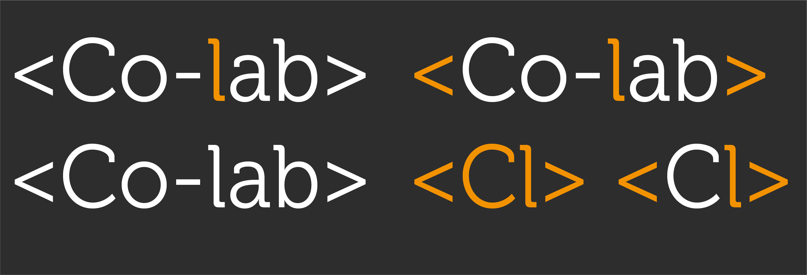

# < Co-Lab >
## Social Network

**Introducción**

Como parte de la currícula de @Laboratoria, se requiere el Producto final del Sprint 3. En el cual las alumnas generan una Red social, haciendo uso de herramientas como User Experience, User Interface, JavaScript, HTML, CSS, JQuery, manejo de Data y una breve introducción a Firebase. Herramientas revisadas hasta el momento durante el bootcamp.

**De manera puntual los requerimientos son:**

  -	Contar con *perfiles de usuarios*
  -	Un *Newsfeed* donde ver las actualizaciones de los contactos
  -	Dónde poder *escribir posts*
  -	Poder *subir fotos*
  -	Capacidad para poder *agregar amigos* /marcas dentro de la red social
  -	Ser *mobile friendly*
  -	*UX* research

## Planificación
Con base en los requerimientos especificados, el equipo procedió a detectar una problemática que pudiera ser resuelta por medio de una red social. Para detectar la problematica, partimos de una idea: **"Las estudiantes de Laboratoria suelen tener dudas similares pero no las resuelven en conjunto"**

Con la finalidad de comprobarlo, se plantearon las siguientes **hipótesis**:

1. “Hay una falta de integración entre alumnas de Laboratoria”
2. “La resolución de problemas y retos de código de Laboratoria puede ser educativa al hacerse en equipo”
3. “Las alumnas y exalumnas, de todas la Sedes, estarían interesadas en participar de una red social que ayude a resolver dudas y fortalecer la comunidad”

Para validar dichas hipótesis y conocer la opinión de las potenciales usuarias, se elaboró un cuestionario de 5 preguntas en Survey Monkey: https://es.surveymonkey.com/r/KFN6RKZ

Obtuvimos un total de 46 respuestas, y podemos ver los siguientes resultados:

###### PREGUNTAS
1. Al estar realizando algún *reto de código individual* (desde casa) ¿qué acción realizas con más frecuencia al tener una **duda técnica**?
2. ¿A qué *porcentaje* de compañeras de tu turno dirías que *desconoces*?

3. ¿Cuál es el *mayor problema* que haz encontrado al tratar de resolver una *duda por tu cuenta*?
4. ¿Consideras que hace falta **comunicación de dudas** entre alumnas a *nivel grupo*?

5. ¿Te gustaría que existiera un foro donde se *resolvieran dudas y problemas* (vía remota en formato de posts) entre la **comunidad de alumnas y ex alumnas de Laboratoria?**

Realizando un análisis de los datos recabados, se pudo llegar a las siguientes conclusiones que guiaron las decisiones para la elaboración de esta red social:

- De **46 alumnas ninguna consulta a una compañera** para resolver dudas
- El promedio de **alumnas con las que no se ha interactuado es de 33%, en el mismo turno**. Aunado a las compañeras de otro turno con las que la interacción es menor
- Los **problemas** con los cuales se enfrentan las compañeras al tratar de resolver una duda **son los mismos**
- El *96.86% de nuestras encuestadas* considera que **falta comunicación de dudas entre compañeras**
- Esa misma cantidad **aprueba la existencia de esta red social.**

Con ello, hemos obtenido una mayor claridad sobre el pensamiento y la experiencia de nuestras compañeras y usuarias para este reto. Hemos podido comprobar que la problematica detectada existe y nuestras hipótesis son verdaderas.

Posteriormente, teniendo en cuenta los requerimientos iniciales y los hallazgos de nuestra investigación, se desglosaron las actividades principales a modo de pseudocódigo y checklists, y ayudadas por un tablero de Trello, pudimos corroborar nuestros avances.
https://trello.com/b/45wLgRqk/producto-final

## Definición del diseño
Una vez determinados los puntos que requieren las usuarias de nuestra nueva red social, se realizaron bocetos sobre la interacción y aspecto que en una primera iteración en sus versiones **Desktop y Mobile**.

Se determinó el nombre **“< Co-Lab >”** el cual ha sido del agrado de las alumnas. Se realiza una primera etapa de maquetación.

Se corroboran mejoras técnicas y de ejecución para el desarrollo front-end; en pseudocódigo y hand-sketch para resolver adecuadamente.

Con esta primera maqueta y habiendo interactuado de forma más profunda con la web-app, se genera una segunda versión. La Home page, ya cuenta con la función de *poder publicar* una pregunta, en primer lugar con un título y un contenido descriptivo. Igualmente con un *buscador* que filtra a los contactos por nombre.

En la siguiente imágen se pueden observar algunas de las modificaciones.

## Diseño mobile friendly
En la versión móvil, encontramos una distribución jerárquica donde lo principal es el perfil de la persona, seguido de un espacio para realizar un propio post, el newsfeed donde se pueden consultar posts de personas en la red y al final un buscador de usuarias, con la posibilidad de ver sus datos e invitar a formar parte de tu red.

## *Resultado*

Dentro de la versión final, podemos observar la implementación de un logotipo que es una variante de el ya existente de < Laboratoria >. Utilizando la Tipografía *Museo Slab 300*, y los *3 colores principales* de su identidad gráfica. Aquí las variantes bocetadas y el icono:

## Firebase

Al acceder al formulario de Inicio de sesión, tenemos la opción de aceder por medio de **ingresar nuestro nombre y contraseña**, dónde sólo se habilita el botón *Entrar* al haber llenado los dos campos. Y tenemos la segunda opción de **ingresar por medio de Google**, el cual al haber iniciado sesión con Google nos direcciona a la página de inicio; función que sucede gracias a la utilización de *Firebase*.

## Flujo de Web-app *(Desktop)*

## Responsive Web Desing *(Mobile)*

